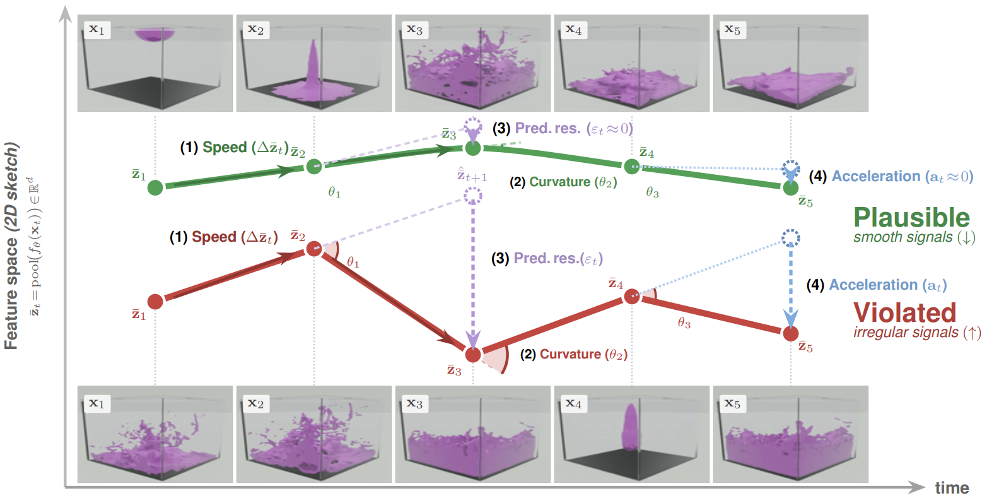

<div align="center">

# GeoPhys: The Geometry of Physical Plausibility

**Physical plausibility is written into the trajectory geometry of frozen image-encoder features. No video training, no physics supervision, no learned ranker.**

[](https://christianinterno.github.io/GeoPhys/)
[](https://christianinterno.github.io/GeoPhys/GeoPhys.pdf)
[](LICENSE)
[](https://creativecommons.org/licenses/by/4.0/)



</div>

## Overview

A frozen image encoder maps each video frame to a pooled feature; stacked across time, the video becomes a trajectory in representation space. Plausible motion keeps that trajectory smooth and locally predictable, while a physical violation disrupts it. GeoPhys reads this off with five training-free kinematic statistics, speed variation, curvature, angle consistency, acceleration, and a linear-prediction residual, computed directly on the features with no learned parameters.

The same score is applied unchanged across three settings: alignment with human EEG responses to object-permanence violations, physics-violation detection, and inference-time best-of-N verification for video generation.

## Highlights

- **State-of-the-art detection.** 98.3% on LikePhys and 93.3% on IntPhys2, where V-JEPA 2, GPT-4o, Gemini, and twelve modern video diffusion models sit near chance.
- **A cheap verifier.** As a best-of-N verifier, GeoPhys lifts MAGI-1 24B from 50.01% to 64.50% on PhysicsIQ, at 1.5x lower wall-clock and 4.65x lower memory than a V-JEPA 2 world-model verifier.
- **Four frozen backbones.** DINOv2, DINOv3, CORnet-S, and VOneNet, none trained on video or physics.

See the [project page](https://christianinterno.github.io/GeoPhys/) for figures, interactive comparisons, and the full result tables, and the [paper](https://christianinterno.github.io/GeoPhys/GeoPhys.pdf) for details.

## Code

**The code will be released here soon.** Watch or star the repository to be notified when it lands. An arXiv link will be added once the preprint is announced.

## Citation

```bibtex
@misc{interno2026geophys,
  title  = {GeoPhys: The Geometry of Physical Plausibility},
  author = {Intern\`{o}, Christian and Pondaven, Alexander and Issa, Habon
            and Pizzati, Fabio and Pinto, Francesco and Olhofer, Markus
            and Laptev, Ivan and Torr, Philip and Simoncelli, Eero P.
            and Hammer, Barbara and Klindt, David},
  year   = {2026},
  url    = {https://christianinterno.github.io/GeoPhys/}
}
```

## License

The paper text and figures are released under [CC BY 4.0](https://creativecommons.org/licenses/by/4.0/). The code, once released, is under the [MIT License](LICENSE).
